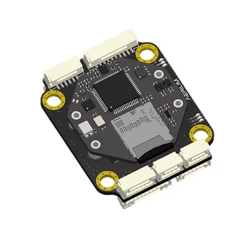
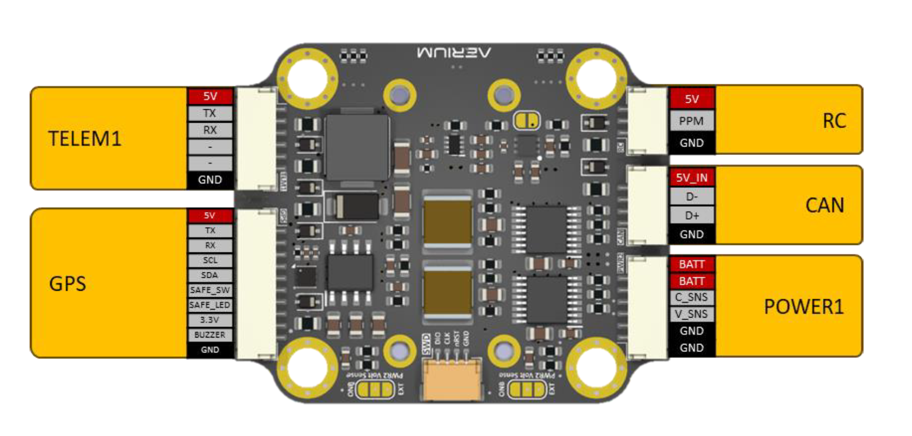

# Radian Flight Controller

## Overview

The **Radian** by [Aerium](https://www.aerium.co.il) is a compact, high-performance flight controller designed for professional multirotors, fixed-wing aircraft, and VTOL platforms. Built to Pixhawk standards, it supports ArduPilot, PX4, and Betaflight firmware, ensuring flexibility across a wide range of applications.

Engineered for reliability and versatility, the Radian integrates advanced sensors, robust power management, and extensive I/O—all within a compact 46 × 38 mm carrier board. The detachable core module, measuring just 32 × 32 mm, enables seamless integration into embedded systems where space is at a premium.

Explore the [Aerium Radian product page](https://www.aerium.co.il/product-page/radian) for detailed specifications, imagery, and purchase options.

## Technical Specifications

- **Processor:** STM32F405RG – ARM Cortex-M4 @ 168 MHz with FPU, 1 MB Flash, 192 KB SRAM  
- **IMUs:** Bosch BMI270 and TDK ICM42688P  
- **Barometers:** Bosch BMP260 and ST LPS22HBTR  
- **Compasses:** Bosch BMM150 and ST LIS3MDL  
- **Firmware Support:** ArduPilot, PX4, and Betaflight  
- **Power Input:** Dual redundant power inputs up to 60V with integrated eFuse, voltage sensing, and DC-DC conversion  
- **Interfaces:**
  - 3 × UART (3.3V TTL)
  - 1 × CAN (DroneCAN / CAN-FD)
  - 2 × I2C (only 1 exposed on the FPV carrier board)
  - 3 × SPI (internal)
  - 1 × RC input
  - 8 × PWM/servo outputs
  - 1 × microSD card slot (for logging)
- **Weight:** Approximately 20 g  
- **Dimensions:**
  - **Carrier board:** 46 × 38 mm (M4 mounting holes for M3 dampers, 30.5 × 30.5 mm spacing)  
  - **Radian core module:** 32 × 32 mm (M2 mounting holes with integrated standoffs)

## Purchase

- Available at the [Aerium online store](https://www.aerium.co.il/product-page/radian)

## Connectors and Pinouts

For detailed pin definitions and usage, refer to the [Radian documentation portal](https://aerium.bitbucket.io/documentation/Product%20Manuals/Radian/).

## UART Port Mapping

| ArduPilot SERIALx | Connector | Function                              |
|-------------------|-----------|----------------------------------------|
| SERIAL1           | TELEM1    | Primary telemetry                      |
| SERIAL2           | TELEM2    | Secondary telemetry or companion link |
| SERIAL3           | GPS       | GNSS module                            |

## PWM / Servo Outputs

- Supports 8 PWM or servo outputs
- Functions can be assigned using `SERVOx_FUNCTION` parameters in supported firmware
- The PWM outputs are grouped as follows:
  - PWM 1-3 in group1
  - PWM 4-6 in group2
  - PWM 7,8 in group3

- Channels within the same group need to use the same output.
- If any channel in a group uses DShot then all channels in the group need to use DShot.  

## RC Input

- Supports PPM-Sum, S.Bus, and iBUS protocols via the RC input port  
- Additional receiver types can be connected via configurable serial ports  
- For setup instructions, consult the [ArduPilot RC systems guide](https://ardupilot.org/copter/docs/common-rc-systems.html)

## Power supply & Battery Monitoring

- Supports dual redundanct 3S-14S battery input
- Dual onboard voltage sensors for independent monitoring of both power inputs  
- Supports external voltage and current monitoring through power connectors  
- Default firmware configurations are pre-mapped to the correct pins  
- Use onboard VSense jumpers to toggle between internal and external sensing for each input  
- Voltage and current scalers can be adjusted for precise measurements  

| Power symbol | Power source | Max power (current) |
|--------------|--------------|---------------------|
| 5V | from 5V BEC | 20W (4A) |
| BAT | directly from battery | (5A) |

## Compass Configuration

- Includes dual onboard compass modules for redundancy  
- Additional external compasses can be connected via the I2C interface  

## RSSI/Analog Airspeed Input

- The board does not have analog inputs (ADC pins) dedicated for RSSI and Airspeed sensor
- RSSI can be read using the RSSI_TYPE parameter except for the RSSI_TYPE=1 (analog input)
- Airspeed sensor is typically connected over I2C rather than analog input

## Firmware Installation

1. Connect the Radian to your PC via USB-C  
2. Launch **Mission Planner** or **QGroundControl**  
3. Select the appropriate board and firmware  
4. Click **Install** and follow the guided steps  
5. Once flashed, perform a power cycle using your power module to verify sensor initialization  

> For initial bootloader flashing, connect the USB cable while holding the boot button to enter DFU mode.

## Support & Community

- **Technical Support:** [Aerium Contact Page](https://www.aerium.co.il/contact)  
- **Community Forum:** [ArduPilot Discourse](https://discuss.ardupilot.org)  
- **Documentation:** [ArduPilot Wiki](https://ardupilot.org)
